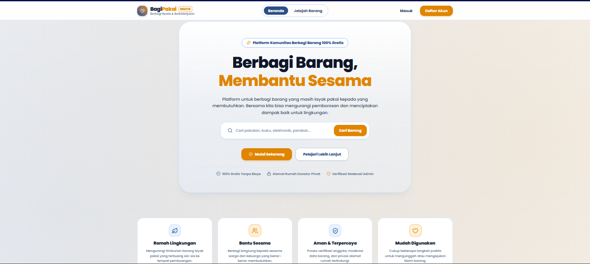
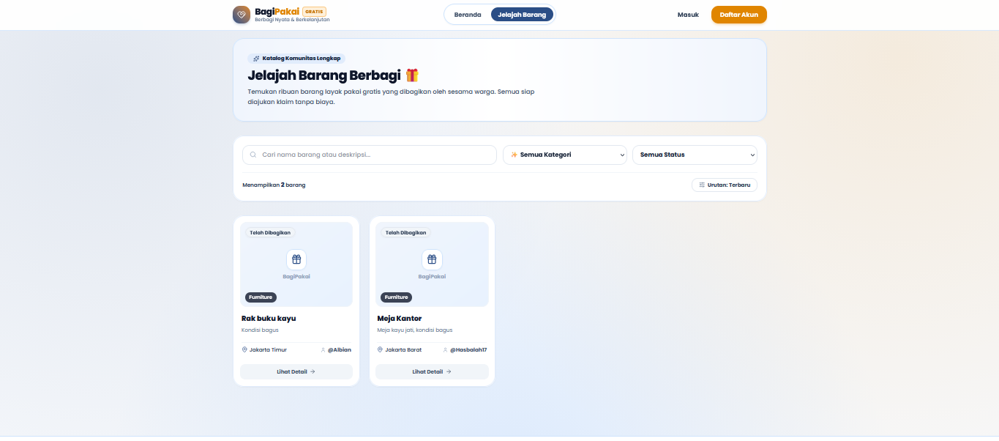
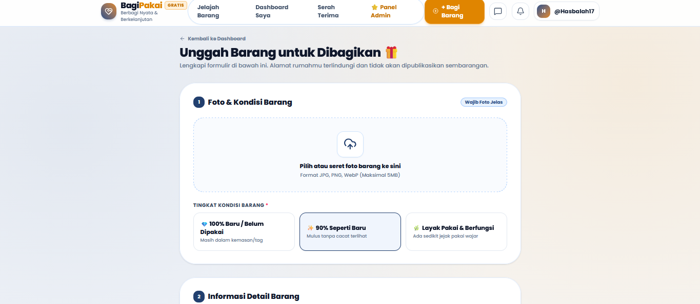
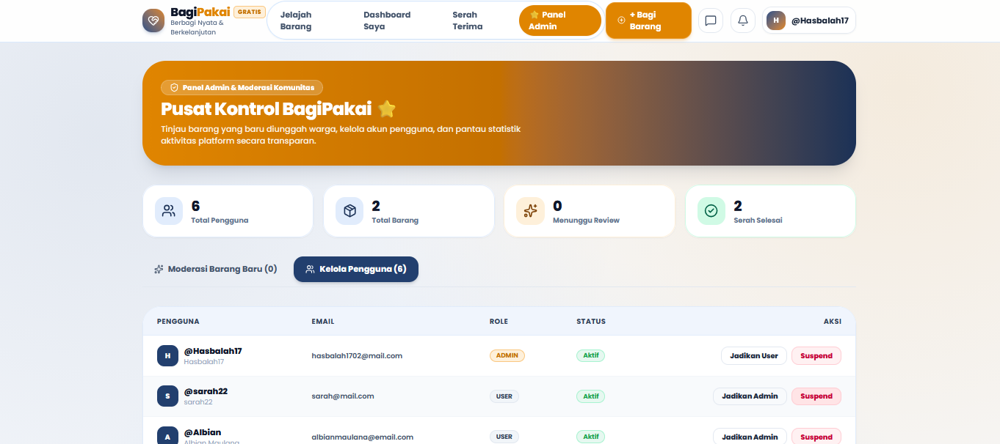

# BagiPakai — Platform Donasi & Berbagi Barang Bekas Layak Pakai

> Proyek Akhir Pelatihan Full-Stack Web Development: React JS & Java Spring Boot

**Peserta:** Albian Maulana
**Repo:** [GitHub Repository Link](https://github.com/USERNAME/REPO_NAME)

---

## Tentang Proyek Ini

BagiPakai adalah platform buat nyalurin barang bekas yang masih layak pakai (furnitur, pakaian, elektronik, buku, dll) ke orang yang butuh — gratis, lewat sistem donasi/klaim. Ada chat langsung antar pengguna, moderasi admin, dan notifikasi real-time.

---

## Teknologi

**Frontend:** React 19 + Vite 6, pnpm, Tailwind CSS, React Router v7, Lucide/Heroicons, native `fetch`

**Backend:** Java 21 + Spring Boot 3.5 (Web, Data JPA/Hibernate, Security dengan JWT + BCrypt, Validation), Maven, MySQL 8

**Testing API:** Postman (collection v2.1 disediakan di root repo)

---

## Fitur

- **Auth** — register, login (JWT), edit profil, role `USER`/`ADMIN`
- **CRUD Barang** — posting, edit, hapus barang; upload foto; lihat barang sendiri (`My Items`) beserta statusnya
- **Cari & Filter** — search by keyword, filter kategori, sorting, semuanya server-side
- **Klaim & Transaksi** — user ajukan klaim → pemilik terima/tolak → otomatis jadi transaksi → konfirmasi selesai
- **Chat & Notifikasi** — pesan langsung antar user, notifikasi otomatis buat update penting
- **Admin** — dashboard statistik, approve/reject barang baru, aktif/nonaktifkan akun user

---

## Struktur Folder

```text
Projek_React Java_BagiPakai/
├── README.md
├── BagiPakai API.postman_collection.json
├── dump-bagigunapakai-202609091236.sql
├── Backend/bagigunapakai/          # Spring Boot
│   └── src/main/java/com/bagipakai/bagigunapakai/
│       ├── config/ controller/ dto/ entity/
│       ├── exception/ repository/ security/
│       └── service/ util/
└── Frontend/bagi-pakai/            # React + Vite
    └── src/
        ├── api/ assets/ context/ pages/
        └── components/ (claims, common, items, layout)
```

---

## Setup Database

```sql
CREATE DATABASE bagigunapakai;
```
```bash
mysql -u root -p bagigunapakai < dump-bagigunapakai-202609091236.sql
```

Lalu sesuaikan `Backend/bagigunapakai/src/main/resources/application.properties`:

```properties
spring.datasource.url=jdbc:mysql://localhost:3306/bagigunapakai?useSSL=false&serverTimezone=UTC
spring.datasource.username=root
spring.datasource.password=
```

---

## Jalankan Backend

```bash
cd "Backend/bagigunapakai"
./mvnw spring-boot:run       # Linux/macOS
.\mvnw.cmd spring-boot:run   # Windows
```
→ aktif di `http://localhost:8080`

## Jalankan Frontend

```bash
cd "Frontend/bagi-pakai"
cp .env.example .env         # Windows: copy .env.example .env
pnpm install
pnpm dev
```
→ buka `http://localhost:5173`

---

## Endpoint API

| Grup | Contoh Endpoint |
| :--- | :--- |
| Auth | `POST /api/auth/register`, `POST /api/auth/login` |
| Items | `GET/POST /api/items`, `GET/PUT/DELETE /api/items/{id}`, `POST /api/items/{id}/foto` |
| Users | `GET/PUT /api/users/me` |
| Claims | `POST /api/claims/items/{itemId}`, `PUT /api/claims/{id}/accept` \| `/reject` |
| Transactions | `GET /api/transactions`, `PUT /api/transactions/{id}/confirm` |
| Chat & Notifikasi | `GET/POST /api/conversations/{id}/messages`, `GET/PUT /api/notifications` |
| Admin | `GET /api/admin/dashboard`, `PUT /api/admin/items/{id}/approve` \| `/reject` |

*(Semua endpoint kecuali register/login/GET items butuh JWT token. Detail lengkap ada di Postman collection.)*

---

## Testing dengan Postman

Import file `BagiPakai API.postman_collection.json` ke Postman, jalankan `Login User` dulu buat dapetin token, terus set ke variabel `{{token}}` biar endpoint yang butuh auth bisa dites.

---

## Screenshot

| Beranda | Jelajah Barang |
| :---: | :---: |
|  |  |

| Form Unggah Barang | Panel Admin |
| :---: | :---: |
|  |  |